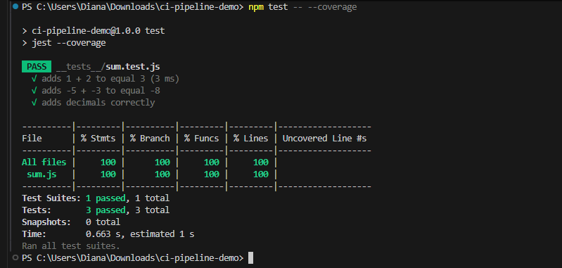

# CI Pipeline Demo

<<<<<<< HEAD
Простий Node.js додаток із multi-stage CI pipeline на GitHub Actions.
=======
Простий Node.js додаток із multi-stage CI pipeline та matrix strategy.
>>>>>>> ca4b2fc (Add full multi-stage CI pipeline with matrix strategy)

## Функціонал
- Функція `sum(a, b)` додає два числа.
- Підтримка цілих та дробових чисел.
- Unit-тести з Jest (coverage ≥70%).

<<<<<<< HEAD
## CI Pipeline
Pipeline має три паралельні jobs:
1. **Unit Tests + Coverage** – запускає тести та генерує coverage report.
2. **ESLint** – перевіряє якість коду.
3. **Security Audit** – запускає `npm audit`.

=======
## CI Pipeline Jobs
- Unit Tests + Coverage
- ESLint Code Quality
- Security Audit (`npm audit`)
- Matrix testing: Node.js 18 & 20, Ubuntu & Windows

## Matrix Testing

| OS            | Node.js Version | Status |
|---------------|----------------|--------|
| Ubuntu        | 18.x           | ✅      |
| Ubuntu        | 20.x           | ✅      |
| Windows       | 18.x           | ✅      |
| Windows       | 20.x           | ✅      |

## Screenshot of GitHub Actions

>>>>>>> ca4b2fc (Add full multi-stage CI pipeline with matrix strategy)
